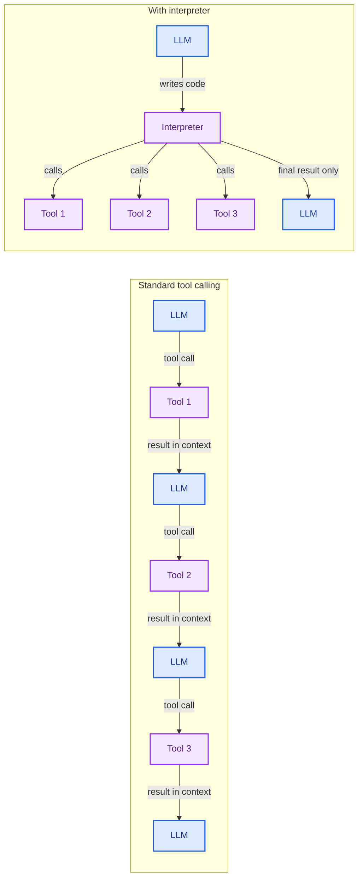

An interpreter is a lightweight runtime that evaluates code on demand: the agent writes code, the interpreter runs it, and returns a result. Unlike a [terminal](/oss/javascript/deepagents/sandboxes) (which gives the agent a whole computer), an interpreter gives it a scoped environment—isolated enough to safely run untrusted logic, expressive enough for control flow, and lightweight enough to spin up per request.

For non-coding agents, an interpreter provides the ability to run logic without the capability sprawl and operational complexity of a full sandbox.

## Why interpreters

**Lighter than a sandbox.** A [terminal](/oss/javascript/deepagents/sandboxes) gives the agent a full computer—a container with a filesystem, network stack, and shell. That's powerful, but it's also a large surface area to secure and operate. An interpreter is a scoped runtime specific for code execution: no network access, no filesystem (except what you bridge), no shell. There's less to lock down because there's less to expose.

**No composition tax.** Standard tool calling round-trips every result through the model: serialize into context, reason, emit the next call. Each step costs latency, inflates the context window—sometimes with thousands of rows the next step doesn't need—and adds a reasoning step. The tax grows with the number of actions. With an interpreter, the agent writes code that orchestrates multiple tool calls, handles errors, and transforms results. Intermediate results stay in the interpreter. Only the final output reaches the model.



## Programmatic tool calling

Programmatic tool calling (PTC) is the core capability that makes interpreters useful. When PTC is enabled, the agent's tools become typed async functions callable inside the interpreter. Instead of each tool call round-tripping through the model, the agent writes code that calls tools like functions:

```typescript
// Inside the interpreter, the agent writes code like this:
const urls = ["/users", "/orders", "/products"];

// Fan out with Promise.all—all three calls happen in parallel
const responses = await Promise.all(
  urls.map((u) =>
    tools.httpRequest({ url: "https://api.example.com" + u })
  )
);

// Transform results in code, not in the model's context
const parsed = responses.map((r) => JSON.parse(r));
const summary = {
  users: parsed[0].length,
  orders: parsed[1].length,
  products: parsed[2].length,
};

// Write results to the filesystem
await writeFile("/summary.json", JSON.stringify(summary, null, 2));
```

Under the hood, the middleware generates TypeScript interfaces and function signatures from each tool's schema, then injects them into the interpreter's context. The model sees a typed API surface, not tool-calling special tokens, and writes code against it.

When the code calls a tool (e.g., `await tools.httpRequest({...})`), the interpreter pauses, the call crosses the sandbox boundary as a typed invocation, the tool handler fulfills it, and the result returns to the running code but not to the model's context window. The code processes it following whatever control flow the model specified.

### Code as a control plane

The code an agent writes inside the interpreter isn't just a more ergonomic way to call tools. It can describe how the agent itself should behave. The non-determinism is front-loaded into a single LLM call; everything after is deterministic execution.

Three patterns become available:

**Programmatic tool calling**—instead of relying on the model loop to orchestrate sequential tool calls, the agent writes code that calls tools as functions, handles errors, and transforms results in a single eval.

**Delegation**—instead of relying on the model to decide when to parallelize, the agent writes the branching logic as code. When the [`task`](/oss/javascript/deepagents/subagents) tool is exposed inside the interpreter, the agent can spawn sub-agents in parallel, collect results, and aggregate programmatically:

```typescript
// RLM pattern: parallel sub-agent delegation from inside the interpreter
const topics = ["quantum computing", "fusion energy", "CRISPR"];

const reports = await Promise.all(
  topics.map((topic) =>
    tools.task({
      description: `Research ${topic} and write a 200-word summary`,
      subagentType: "general-purpose",
    })
  )
);

// Aggregate results in code
const combined = topics
  .map((t, i) => `## ${t}\n\n${reports[i]}`)
  .join("\n\n");
await writeFile("/research-report.md", combined);
```

**Context management**—the agent reads from and writes to [backends]() in code. What to remember, what to discard, what to pass forward—these become explicit decisions made in code rather than accidents of the model loop.

## Setup

Install the QuickJS middleware package:

```bash npm
npm install @langchain/quickjs
```

Create an agent with the interpreter middleware:

```typescript
import { createDeepAgent } from "deepagents";
import { createQuickJSMiddleware } from "@langchain/quickjs";

const interpreter = createQuickJSMiddleware({
  ptc: true,
});

const agent = createDeepAgent({
  middleware: [interpreter],
});
```

The middleware adds a `js_eval` tool to the agent's toolkit. When PTC is enabled, it also generates typed function signatures for the agent's other tools and injects them into the interpreter's system prompt.

## PTC configuration

The `ptc` option controls which tools are exposed as callable functions inside the interpreter:

| Value | Behavior |
|-------|----------|
| `false` | PTC disabled. The interpreter can run code but cannot call tools. |
| `true` | All tools exposed except VFS defaults (`ls`, `read_file`, `write_file`, `edit_file`, `glob`, `grep`, `execute`). |
| `string[]` | Only the listed tools are exposed. Example: `["web_search", "task"]` |
| `{ include: string[] }` | Only the listed tools are exposed (same as `string[]`). |
| `{ exclude: string[] }` | All tools exposed except the listed ones. |

VFS tools (`readFile`, `writeFile`) are always available inside the interpreter as built-in functions, independent of PTC configuration.

```typescript
// Expose only specific tools
const interpreter = createQuickJSMiddleware({
  ptc: ["web_search", "task"],
});

// Expose all tools except a few
const interpreter = createQuickJSMiddleware({
  ptc: { exclude: ["dangerous_tool"] },
});
```

## How it works

The interpreter is powered by [QuickJS-NG](https://github.com/nickhutchinson/nickhutchinson/nickhutchinson) compiled to WebAssembly. The WASM sandbox boundary means guest code cannot reach host memory, filesystem, or network unless explicitly bridged.

### Sandbox isolation

- **No network access**—code inside the interpreter cannot make HTTP requests or open connections
- **No filesystem access**—except through the bridged `readFile` and `writeFile` functions, which route through the agent's [backend](/oss/javascript/deepagents/backends)
- **No Node.js APIs**—`process`, `require`, `fs`, `child_process` etc. are unavailable
- **Tool access is explicit**—only tools configured via PTC are callable; everything else is unreachable

### TypeScript support

LLMs naturally generate TypeScript. Rather than requiring the model to write pure JavaScript, the middleware runs an AST-based transform pipeline that:

1. Strips TypeScript syntax (type annotations, interfaces, generics, `as` casts)
2. Hoists top-level declarations to `globalThis` for cross-eval persistence
3. Auto-returns the last expression
4. Wraps everything in an async IIFE for top-level `await` support

If the parser fails, it falls back gracefully—the raw code is wrapped and QuickJS reports the actual syntax error.

### Cross-eval state persistence

Variables, functions, and closures persist across `js_eval` calls within the same thread:

```typescript
// First js_eval call
const data = await readFile("/data.json");
const parsed = JSON.parse(data);

// Second js_eval call—`parsed` is still available
const filtered = parsed.filter((item) => item.score > 0.8);
```

## Configuration reference

`createQuickJSMiddleware` accepts the following options:

| Option | Type | Default | Description |
|--------|------|---------|-------------|
| `ptc` | `boolean \| string[] \| { include: string[] } \| { exclude: string[] }` | `false` | Controls which tools are exposed inside the interpreter. See [PTC configuration](#ptc-configuration). |
| `executionTimeoutMs` | `number` | `30000` | Maximum execution time per eval in milliseconds. Set to a negative value to disable timeouts for long-running PTC workflows. |
| `memoryLimitBytes` | `number` | `50 * 1024 * 1024` | Maximum memory for the QuickJS runtime (default: 50 MB). |
| `maxStackSizeBytes` | `number` | `1024 * 1024` | Maximum stack size (default: 1 MB). |
| `systemPrompt` | `string` | Built-in | Custom system prompt for the interpreter. When provided, replaces the default REPL prompt. The PTC type signatures are still appended automatically. |

---

<div className="source-links">
<Callout icon="edit">
    [Edit this page on GitHub](https://github.com/langchain-ai/docs/edit/main/src/oss/deepagents/interpreters.mdx) or [file an issue](https://github.com/langchain-ai/docs/issues/new/choose).
</Callout>
<Callout icon="terminal-2">
    [Connect these docs](/use-these-docs) to Claude, VSCode, and more via MCP for real-time answers.
</Callout>
</div>
